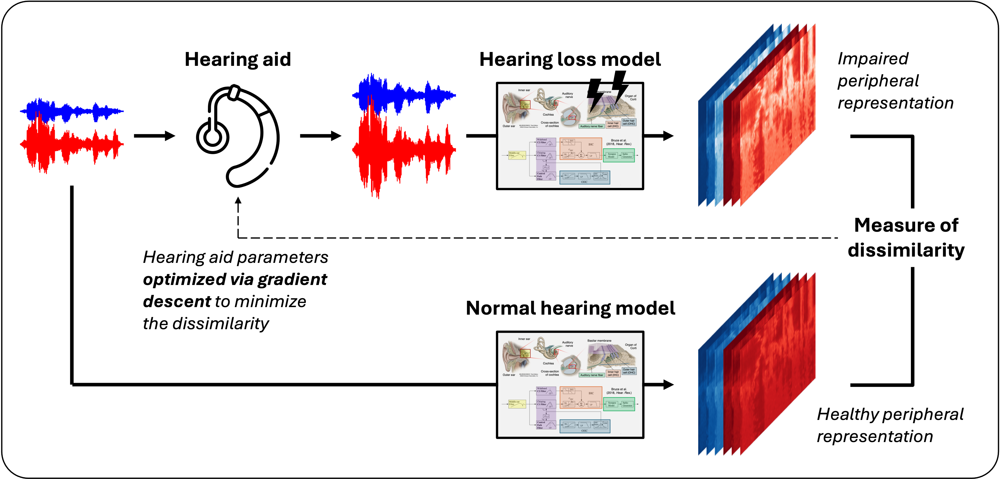

# Auditory modeling and machine learning in PyTorch

This tutorial aims to introduce auditory modeling and optimization in [PyTorch](https://docs.pytorch.org/docs/stable/index.html), a machine learning framework for the Python programming language. Some reasons to consider using PyTorch include:

- **High-performance computing**: computational models can be efficiently run at scale on (multiple) CPUs or GPUs with minimal code modification.
- **Neural network compatibility**: models can be integrated with artificial neural networks, which are readily implemented in PyTorch.
- **Automatic differentiation**: machine learning relies heavily on **gradient descent** algorithms, in which model parameters are optimized to minimize a loss function. This requires iteratively adjusting parameters according to the *gradient* of the loss function with respect to said parameters. Machine learning frameworks like PyTorch have [**automatic differentiation**](https://pytorch.org/tutorials/beginner/basics/autogradqs_tutorial.html), meaning they automatically calculate and keep track of these gradients (greatly simplifying the code needed to train a model).

To illustrate some of these advantages for hearing science applications, the [**DEMO notebook**](DEMO.ipynb) walks through:
1. A simple, differentiable auditory nerve model implemented in PyTorch
2. Crudely simulating peripheral effects of hearing loss
3. Defining a model-based loss function for hearing aid optimization
4. Optimizing hearing aid parameters via gradient descent




## Requirements

The [**DEMO notebook**](DEMO.ipynb) was designed be run in [Google Colab](https://colab.research.google.com/), which requires a Google account. The notebook can also be run locally with minimal Python 3.9+ [requirements](requirements.txt), though access to a CUDA-enabled GPU is highly recommended. The free-tier GPU available through Google Colab is sufficient.

<a href="https://colab.research.google.com/github/msaddler/auditory_machine_learning/blob/main/DEMO.ipynb" target="_parent"></a>


## Contents

```
auditory_machine_learning
|__ DEMO.ipynb         <-- Main demo notebook (start here)
|__ datasets.py        <-- PyTorch dataset classes to generate or load sound waveforms
|__ filters.py         <-- Python filter implementations
|__ modules.py         <-- PyTorch modules for auditory modeling
|__ utils.py           <-- Helper functions for plotting and audio manipulation
|__ requirements.txt   <-- Python packages needed to run this code
|__ data               <-- Small dataset of 100 brief speech clips
    |__ 000.wav
    |__ 001.wav
        ...
    |__ 099.wav
```


## Citations

The code provided here has been adapted from my own research:
- Hearing loss simulation [code](modules.py)
    - <sub><sup>Saddler, Dau, & McDermott (2025). [Towards individualized models of hearing-impaired speech perception](https://www.isca-archive.org/clarity_2025/saddler25_clarity.pdf). *Proc. ISCA Clarity*.</sup></sub>
- Simple auditory nerve model [code](https://github.com/msaddler/phaselocknet)
    - <sub><sup>Saddler & McDermott (2024). [Models optimized for real-world tasks reveal the task-dependent necessity of precise temporal coding in hearing](https://www.nature.com/articles/s41467-024-54700-5). *Nat. Commun.*</sup></sub>
- Auditory model-based loss function optimization [code](https://github.com/msaddler/auditory-model-denoising)
    - <sub><sup>Saddler & Francl et al. (2021). [Speech denoising with auditory models](https://doi.org/10.21437/Interspeech.2021-1973). *Proc. Interspeech*.</sup></sub>


## Contact

Mark R. Saddler (marksa@dtu.dk)

